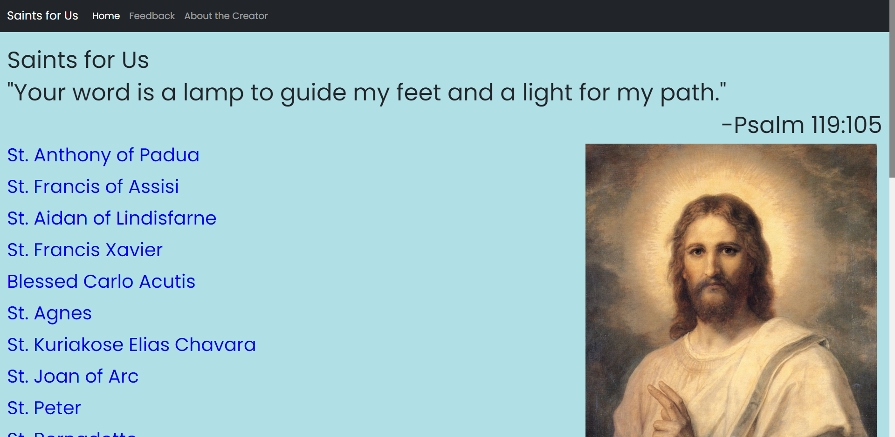
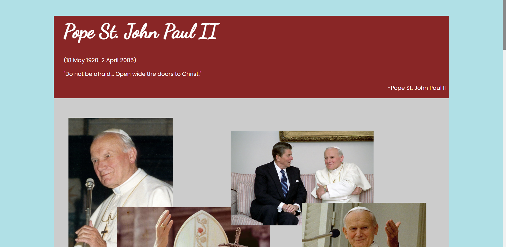

# Saints for Us

This is a website about a few saints. This is a personal project that I began because there are not  
many websites on this topic. This project uses the Flask framework for the backend and I have  
used plain HTML, CSS and JavaScript.

## Content and Styling

I have used Bootstrap for some of the styles.  
I have made some mistakes with the numbering for each saint in commit messages.  
The views.py contains the route for the home page and the other main pages,  
while the pages.py contains the routes for all the saints.
I will probably dockerize this application later on.
This Website will be deployed soon.

## Pictures

    
     
     
    

